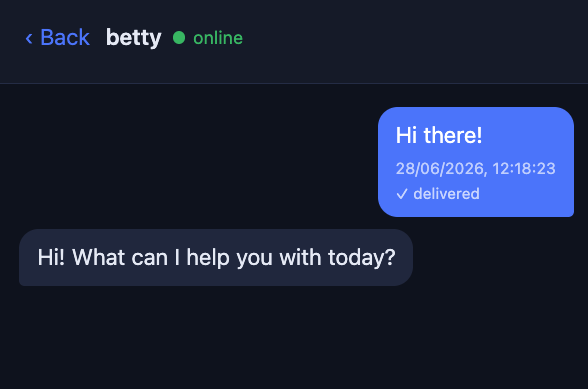

# hap

Talk to your local Hermes agents from your phone, like a simple messaging app.



hap (Hermes Agent PWA) is a small, self-hosted gateway for messaging your own
[Hermes](https://hermes-agent.nousresearch.com/) agents from a phone, tablet or
browser. You pick an agent, send a message, and the reply turns up in the same
conversation, whether the agent answers in two seconds or two hours. It is
built for one person and a handful of agents. No third-party messaging
platforms sit in the middle, there is no message broker, and nobody else is
reading your threads.

## What it does

You open a private URL, log in, and chat with your agents. Each agent has its
own conversations, and history sticks around, so a thread is still there when
you reopen the app. New replies arrive live while the app is open (over
Server-Sent Events) and are waiting for you when it is closed. If an agent is
offline, hap tells you instead of leaving you to wonder. And if you hid a
conversation, a late reply quietly brings it back.

There are two pieces. It is worth pinning down their names early, because
Hermes also has something it calls a gateway:

- The **hap gateway**: a FastAPI app with a SQLite store that serves the web app
  (an installable PWA) and a couple of endpoints for agents. SQLite is the
  durable source of truth, and there is no message broker.
- A **Hermes plugin**: a small platform adapter that runs inside the **Hermes
  gateway** (Hermes's own messaging-gateway runner, the part that hosts
  plugins). It polls the hap gateway for your messages and posts the agent's
  replies back. As far as the agent is concerned, hap is just another chat
  platform, so it needs no special knowledge of how hap works.

The browser only ever names an agent by id, never a raw address, and the agent
reaches the hap gateway with a bearer token.

## Prerequisites

- Python 3.11 or newer, and [uv](https://docs.astral.sh/uv/) for dependencies.
- [Hermes](https://hermes-agent.nousresearch.com/) installed on each machine
  whose agents you want to reach.
- A way for your phone to reach the hap gateway: Tailscale (recommended), Caddy
  with a public domain, or the same local network.

## Getting started

The simplest case is a single machine that also runs Hermes, so that is what
these steps cover. Clone the repository, then from its directory:

```
./scripts/install.sh
```

The installer:

- syncs the gateway's dependencies with uv,
- generates a bearer token (saved to `hap_token.txt`) and derives a six-digit
  login PIN from it,
- copies the plugin into `~/.hermes/plugins/hap`, writes its config, and enables
  it,
- prints the URL to open, the token, and the PIN.

A few options worth knowing: `--agent <name>` sets this box's agent id (default
`hermes`), `--profile <name>` installs into a non-default Hermes profile (see
[Multiple agents](#multiple-agents)), `--host <addr>` sets the gateway bind
address (default `127.0.0.1`), and `--public-url <url>` sets the address printed
for your phone (it only changes the printed text, it does not configure
anything). Run `./scripts/install.sh --help` for the full list.

Then start the two pieces, in separate terminals or as services:

```
uv run uvicorn app.main:app --host 127.0.0.1 --port 8088   # the hap gateway
hermes gateway run                                         # Hermes + the plugin
```

Open the printed URL and log in with either the full token or the short PIN. If
Hermes was already running, you need to restart it to pick up the plugin (see
[Running as a service](#running-as-a-service)).

## Reaching it from your phone

The hap gateway binds to `127.0.0.1` by default, so your phone needs a way in.
Here are the options, easiest first:

- Tailscale (recommended), because it gives you HTTPS, which the installable PWA
  needs:

  ```
  tailscale serve --bg 8088
  ```

  then open `https://<your-machine>.<your-tailnet>.ts.net`. A few first-time
  notes: your tailnet may need Serve (and HTTPS) switched on, and Tailscale
  prints an admin console link if so; on Linux you will likely need `sudo` (or
  `sudo tailscale set --operator=$USER` once), whereas on macOS the app usually
  grants this already; and the serve config persists across reboots, so it is a
  one-time step, not something to run from a service.
- Caddy, for a public domain with automatic HTTPS. See
  [`caddy/Caddyfile.example`](caddy/Caddyfile.example).
- Same LAN only. Re-run the installer with `--host 0.0.0.0` and use
  `http://<lan-ip>:8088`.

One catch to be aware of: "Add to Home Screen", offline support and the service
worker only work over HTTPS or on `localhost`, because browsers insist on a
secure context for service workers. Plain http to a LAN or Tailscale IP runs
fine as a web page, it just will not install as an app. If you want the full
installable PWA, Tailscale's HTTPS (above) is the easiest route to it.

## Multiple agents

One hap gateway can serve several agents. They are told apart by `agent_id`, not
by token: every agent shares the single bearer token, since the whole thing
assumes one trusted human. Each agent is just another copy of the plugin, living
in that agent's Hermes home and polling the same gateway.

Hermes keeps extra agents in profiles. Each profile is a parallel home under
`~/.hermes/profiles/<profile>/`, with its own `plugins/` directory; the default
agent lives in `~/.hermes/` itself. To add an agent in a profile, run the
installer again with `--profile`:

```
./scripts/install.sh --profile <profile>
```

That drops the plugin into `~/.hermes/profiles/<profile>/plugins/hap/`, writes a
`hap.json` there with the same token and gateway URL but `agent_id` set to the
profile name, and enables it with `hermes -p <profile> plugins enable hap`. Add
`--agent <name>` if you want the id to differ from the profile name.

Then restart that profile's Hermes gateway so it loads the plugin (see below).
The new agent appears in the app's list, and in `/api/agents`, once it starts
polling.

## Configuration

The hap gateway reads a few environment variables, all optional:

- `HAP_AUTH_TOKEN`: the shared bearer token. If unset, it is read from
  `hap_token.txt` (or the file named by `HAP_TOKEN_FILE`).
- `HAP_HOST` / `HAP_PORT`: bind address and port (default `127.0.0.1:8088`).
- `HAP_COOKIE_SECURE`: set to `true` when serving over HTTPS (behind Caddy or
  Tailscale) so the session cookie is marked Secure. Leave it `false` for
  plain-http localhost or LAN. Mind the trap in both directions: `true` over
  `http://localhost` makes login silently fail, because the browser never sends
  a Secure cookie over http; `false` over HTTPS works, but the cookie is not
  Secure-flagged.
- `HAP_DB_PATH`: SQLite file path (default `hap.db`).

The plugin reads `~/.hermes/plugins/hap/hap.json` (or the matching path inside a
profile), which the installer writes. See
[`hermes_plugin/hap/hap.json.example`](hermes_plugin/hap/hap.json.example) for
the shape: the gateway URL it connects to, the bearer token, this agent's id,
and the poll interval.

## Running as a service

There are two long-running pieces, and two ways to keep them up.

The Hermes side matters most, because it does the polling. `hermes gateway run`
and `hermes gateway restart` run in the **foreground** and take over your shell:
start one from a throwaway shell and it dies when the shell exits, and it can
quietly replace a gateway you already had running. For anything you want to
keep, use Hermes's own service instead:

```
hermes gateway install      # one-time; also enables linger, so it survives a reboot
hermes gateway start
hermes gateway stop
```

Add `-p <profile>` for an agent in a profile, for example
`hermes -p <profile> gateway start`. And if Hermes was already running when you
enabled the plugin, restart it: enabling alone only takes effect on the next
session.

The hap gateway is simpler. [`systemd/hap-gateway.service`](systemd/hap-gateway.service)
is a starting point for running it under systemd on a Pi or VPS. Read the
comments at the top, they flag the few things to adjust: the paths, the user,
and a mount dependency if the repo lives on a USB drive or NAS. Put Caddy or
Tailscale in front for HTTPS, and set `HAP_COOKIE_SECURE=true` when you do.

## Updating

When a new version lands you do not need to work out whether it was the gateway,
the plugin or the web app that changed. Run all of these from the repository
directory, in order, and everything ends up current. This assumes the usual
setup: both pieces running as services (see
[Running as a service](#running-as-a-service)).

```
git pull                                     # fetch the new code
./scripts/install.sh                         # re-sync deps, refresh the plugin
sudo systemctl restart hap-gateway           # restart the hap gateway
hermes gateway stop && hermes gateway start  # reload the plugin into Hermes
```

A few things worth knowing:

- **Re-running the installer is safe.** It reuses your existing `hap_token.txt`
  rather than making a new one, so your login token and PIN do not change. It
  re-syncs the gateway's dependencies and copies the latest plugin into
  `~/.hermes/plugins/hap`.
- **You do need to restart both pieces.** The installer updates files but starts
  nothing: the hap gateway only picks up new web-app and server code when it
  restarts, and Hermes only loads the new plugin when its gateway restarts.
- **More than one agent?** Re-run the installer once per profile, exactly as you
  first set it up (`./scripts/install.sh --profile <name>`), then restart that
  profile's gateway with `hermes -p <name> gateway stop` followed by
  `hermes -p <name> gateway start`. The single hap gateway restart above already
  covers them all.

Then on your phone, **pull-to-refresh, or close and fully reopen the app**, so it
fetches the new web app. It caches itself for offline use, so if you still see the
old version, refresh once more. To confirm it all took: open the app, check your
conversations are still there, and send yourself a test message.

## Checking a live box first

Installing onto a machine that is already running Hermes? These read-only
commands show you what is there before you change anything:

```
hermes profile list                # which profiles exist, and which gateways run
hermes gateway list                # running gateways and their PIDs
hermes plugins list                # is hap enabled in the default profile?
hermes -p <profile> plugins list   # ... and in a given profile
```

After installing, the one-line "is it actually polling?" check:

```
curl -s -H "Authorization: Bearer $(cat hap_token.txt)" http://127.0.0.1:8088/api/agents
```

Each agent listed with `"online": true` has a live poll loop.

## Contributing

Contributions are welcome. To get set up:

```
git clone https://github.com/ohnotnow/hermes-agent-pwa
cd hermes-agent-pwa
uv sync
```

Run the gateway with `uv run uvicorn app.main:app --reload` and open
http://127.0.0.1:8088.

## Licence

Released under the MIT Licence. See [LICENSE](LICENSE).
